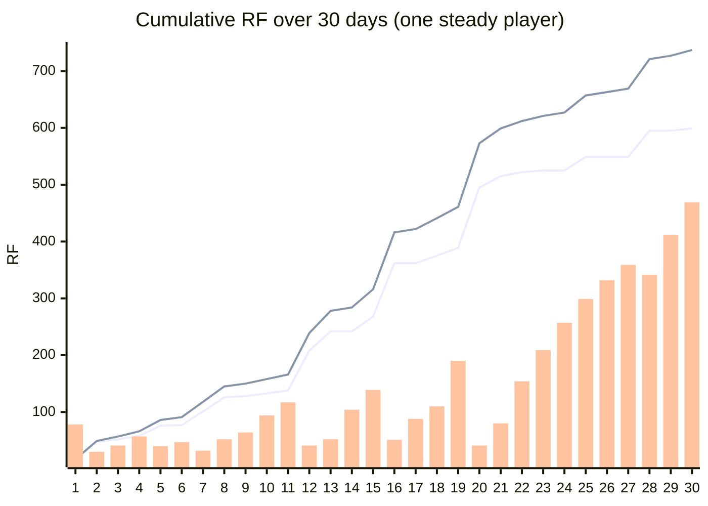

# Lemon Island economy report

Generated by `npm run economy` (`tools/economy-report.ts`). The simulation plays the **real game code** headlessly: the same crowd sim (`sim.ts`), lemon market and ledger (`economy.ts`) and island events (`events.ts`: cruise ships with tourists, lemon shortages, rival stands, food critics) the game runs, for **30 days × 25 random seeds** per strategy. All RF is simulated demo RF.

## Where RF goes

RF is never minted by the game. Every flow moves RF between players and Friends, or burns it.

| Flow | Rule | Where the RF ends up |
|---|---|---|
| Cups | Friends pay your cup price | Your balance |
| Lemons | Bought on a shared market, 0.5 RF base, +0.25% per lemon bought today | **50% burned**, 50% to the farmer Friends' wallets |
| Stalls & upgrades | Lemon Stand 30 · Ice Pop Cart 55 · Juice Bar 120 · Umbrellas 25 · Big Jugs 35 · Neon Sign 45 · Lemon Grove 150 · Tour Balloon 200 RF | **50% burned**, 50% to active Friend rewards (the Rare Friends 50/50 rule) |
| Helpers | 1.5 RF per day for every extra stall's Friend | Straight into the hired Friend's wallet |
| Spoilage | 25% of leftover lemons rot overnight | Lost stock: a sink that punishes over-buying |

Start: 100 RF · 1 lemon = 2 cups · a day lasts about 36 seconds.

## Four ways to play (mean of 25 seeds; flows over 30 days)

| Strategy | Cups sold | Daily sales, week 4 | Stalls | Balance day 30 | Balance day 60 | RF burned | RF paid to other Friends | Runs that dipped under 5 RF |
|---|---:|---:|---:|---:|---:|---:|---:|---:|
| **Steady** (prices at the in-game "good price", reinvests) | 945 | 65.6 | 5.0 | 274 | 1,519 | 591 | 723 | 0/25 |
| **Greedy** (prices 40% above it, reinvests) | 364 | 28.1 | 4.1 | 70 | 235 | 286 | 373 | 0/25 |
| **Bargain** (prices 30% below it, reinvests) | 1,164 | 59.7 | 5.0 | 125 | 800 | 573 | 696 | 0/25 |
| **Saver** (good price, never builds) | 372 | 15.4 | 1.0 | 377 | 677 | 80 | 80 | 0/25 |

**What this shows**
- **Pricing is a real decision.** Overcharging (Greedy) scares customers off and sells far fewer cups; undercharging (Bargain) sells more but earns less per cup. The in-game "good price" is close to the sweet spot.
- **Investing pays, like a tycoon should.** The Steady builder has less cash while it reinvests, but by week 4 it sells several times more per day, overtakes the Saver's balance on day 36 (average of 25 seeds) and ends day 60 2.2× richer.
- **Growth drives the sinks.** The Steady builder burns and pays out far more RF than the Saver, because every stall and upgrade is a 50/50 burn and every extra stall pays a Friend's wages. The more a player succeeds, the more RF they burn.
- **Hard to go broke playing sensibly.** The reserve rule keeps lemon and wage money back before building.

## A typical steady run, day by day (median seed)

*Lines: RF burned (lower) and RF paid to other Friends (upper), cumulative. Bars: the player's balance each evening.*

| Day | Weather | Event | Cups | Sales | Profit | Balance | Stalls | Lemon price | Burned (total) | To Friends (total) |
|---:|---|---|---:|---:|---:|---:|---:|---:|---:|---:|
| 1 | cloudy |  | 12 | 10.8 | -22.2 | 77.8 | 2 | 0.51 | 16.5 | 16.5 |
| 2 | cloudy | critic | 16 | 14.4 | -46.7 | 29.5 | 3 | 0.52 | 47.1 | 48.6 |
| 3 | sunny | rival | 24 | 24.8 | +14.4 | 40.6 | 3 | 0.53 | 52.5 | 57.0 |
| 4 | sunny | cruise | 25 | 31.5 | +20.2 | 57.2 | 3 | 0.52 | 58.4 | 65.9 |
| 5 | cloudy |  | 22 | 20.5 | -23.8 | 39.7 | 3 | 0.52 | 75.9 | 86.4 |
| 6 | rain | critic | 18 | 12.6 | +4.8 | 46.7 | 3 | 0.51 | 77.2 | 90.7 |
| 7 | festival |  | 29 | 37.2 | -1.9 | 32.5 | 3 | 0.53 | 101.4 | 117.9 |
| 8 | hot |  | 40 | 70.8 | +11.8 | 51.6 | 3 | 0.56 | 125.8 | 145.3 |
| 9 | cloudy |  | 21 | 19.3 | +10.0 | 63.9 | 3 | 0.56 | 127.8 | 150.3 |
| 10 | sunny | critic | 33 | 43.8 | +31.5 | 94.3 | 3 | 0.57 | 132.9 | 158.4 |
| 11 | sunny | rival | 36 | 36.0 | +22.7 | 117.4 | 3 | 0.58 | 137.9 | 166.4 |
| 12 | hot | shortage | 38 | 66.6 | -72.1 | 41.0 | 4 | 0.83 | 207.9 | 239.4 |
| 13 | sunny | cruise | 46 | 84.0 | +20.5 | 52.0 | 5 | 0.84 | 242.1 | 278.1 |
| 14 | festival |  | 30 | 58.2 | +35.0 | 104.2 | 5 | 0.77 | 242.1 | 284.1 |
| 15 | hot |  | 44 | 92.2 | +60.0 | 139.0 | 5 | 0.83 | 267.8 | 315.8 |
| 16 | hot | shortage | 48 | 106.2 | -86.0 | 50.5 | 5 | 1.16 | 362.2 | 416.2 |
| 17 | cloudy | rival | 32 | 43.7 | +10.1 | 88.3 | 5 | 1.05 | 362.2 | 422.2 |
| 18 | sunny | critic | 32 | 53.5 | +21.5 | 109.8 | 5 | 0.97 | 375.2 | 441.2 |
| 19 | hot |  | 49 | 113.3 | +68.2 | 190.1 | 5 | 0.97 | 388.7 | 460.7 |
| 20 | sunny |  | 42 | 68.4 | -167.8 | 40.6 | 5 | 0.88 | 494.6 | 572.6 |
| 21 | festival |  | 39 | 84.8 | +40.3 | 79.7 | 5 | 0.83 | 514.5 | 598.5 |
| 22 | hot | rival | 50 | 94.9 | +55.6 | 154.2 | 5 | 0.83 | 521.7 | 611.7 |
| 23 | sunny |  | 42 | 68.6 | +35.8 | 209.3 | 5 | 0.80 | 525.5 | 621.5 |
| 24 | rain | shortage | 35 | 53.9 | +24.6 | 257.2 | 5 | 1.01 | 525.5 | 627.5 |
| 25 | hot | rival | 47 | 95.2 | +52.9 | 298.6 | 5 | 1.44 | 549.4 | 657.4 |
| 26 | cloudy | critic | 30 | 39.4 | +9.5 | 331.9 | 5 | 1.33 | 549.4 | 663.4 |
| 27 | rain |  | 24 | 33.0 | +8.6 | 358.9 | 5 | 1.21 | 549.4 | 669.4 |
| 28 | festival |  | 38 | 79.5 | +21.2 | 340.8 | 5 | 1.16 | 595.2 | 721.2 |
| 29 | sunny |  | 47 | 77.3 | +29.8 | 412.1 | 5 | 1.04 | 595.2 | 727.2 |
| 30 | sunny |  | 43 | 71.3 | +29.6 | 469.0 | 5 | 1.31 | 599.4 | 737.4 |

Negative-profit days are build days: the player spent profit on a new stall or upgrade (half of it burned).

## At scale

One steady player burns about **591 RF** and pays about **723 RF** to other Friends in 30 in-game days.

| Players | RF burned per 30 days | RF paid to Friends per 30 days | Burned per year, share of RF supply |
|---:|---:|---:|---:|
| 100 | 59,093 RF | 72,251 RF | 0.07% |
| 1,000 | 590,929 RF | 722,509 RF | 0.75% |
| 10,000 | 5,909,288 RF | 7,225,088 RF | 7.48% |

*RF supply: 948,594,402 (totalSupply of the RF token on Robinhood chain, read 2026-09-29; the in-game Economy sheet reads it live). The lemon market also rises with total demand, so more players means pricier lemons and more RF burned per cup.*

## Going live

- A shared lemon market contract: price impact from all players' buys, the 50% burn, and 50% streamed to farmer Friends.
- Stall and upgrade payments through the Rare Friends 50/50 gameplay-payment rule.
- Helper wages as direct transfers to the hired Friend's wallet.
- Cup sales from real players' Friends visiting each other's islands.
