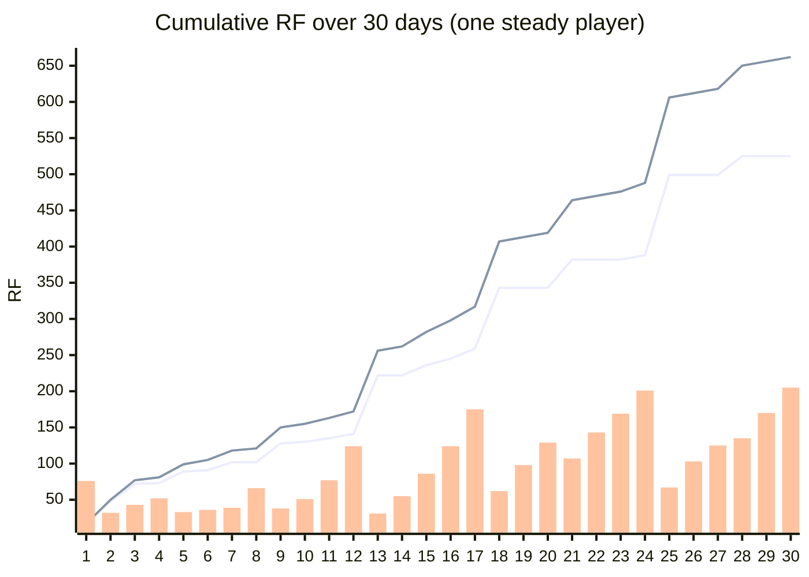

# Lemon Island economy report

Generated by `npm run economy` (`tools/economy-report.ts`). The simulation plays the **real game code** headlessly: the same crowd sim (`sim.ts`), lemon market and ledger (`economy.ts`) the game runs, for **30 days × 25 random seeds** per strategy. All RF is simulated demo RF.

## Where RF goes

RF is never minted by the game. Every flow moves RF between players and Friends, or burns it.

| Flow | Rule | Where the RF ends up |
|---|---|---|
| Cups | Friends pay your cup price | Your balance |
| Lemons | Bought on a shared market, 0.5 RF base, +0.25% per lemon bought today | **50% burned**, 50% to the farmer Friends' wallets |
| Stalls & upgrades | Lemon Stand 30 · Ice Pop Cart 55 · Juice Bar 120 · Umbrellas 25 · Big Jugs 35 · Neon Sign 45 · Lemon Grove 150 · Tour Balloon 200 RF | **50% burned**, 50% to active Friend rewards (the Rare Friends 50/50 rule) |
| Helpers | 1.5 RF per day for every extra stall's Friend | Straight into the hired Friend's wallet |
| Spoilage | 25% of leftover lemons rot overnight | Lost stock: a sink that punishes over-buying |

Start: 100 RF · 1 lemon = 2 cups · a day lasts about 36 seconds.

## Four ways to play (mean of 25 seeds; flows over 30 days)

| Strategy | Cups sold | Daily sales, week 4 | Stalls | Balance day 30 | Balance day 60 | RF burned | RF paid to other Friends | Runs that dipped under 5 RF |
|---|---:|---:|---:|---:|---:|---:|---:|---:|
| **Steady** (prices at the in-game "good price", reinvests) | 872 | 60.5 | 5.0 | 233 | 1,549 | 518 | 648 | 0/25 |
| **Greedy** (prices 40% above it, reinvests) | 349 | 31.4 | 4.4 | 84 | 262 | 275 | 365 | 1/25 |
| **Bargain** (prices 30% below it, reinvests) | 1,179 | 63.1 | 5.0 | 148 | 1,183 | 581 | 708 | 0/25 |
| **Saver** (good price, never builds) | 341 | 13.4 | 1.0 | 368 | 689 | 60 | 60 | 0/25 |

**What this shows**
- **Pricing is a real decision.** Overcharging (Greedy) scares customers off and sells far fewer cups; undercharging (Bargain) sells more but earns less per cup. The in-game "good price" is close to the sweet spot.
- **Investing pays, like a tycoon should.** The Steady builder has less cash while it reinvests, but by week 4 it sells several times more per day, overtakes the Saver's balance on day 36 (average of 25 seeds) and ends day 60 2.2× richer.
- **Growth drives the sinks.** The Steady builder burns and pays out far more RF than the Saver, because every stall and upgrade is a 50/50 burn and every extra stall pays a Friend's wages. The more a player succeeds, the more RF they burn.
- **Hard to go broke playing sensibly.** The reserve rule keeps lemon and wage money back before building.

## A typical steady run, day by day (median seed)

*Lines: RF burned (lower) and RF paid to other Friends (upper), cumulative. Bars: the player's balance each evening.*

| Day | Weather | Cups | Sales | Profit | Balance | Stalls | Lemon price | Burned (total) | To Friends (total) |
|---:|---|---:|---:|---:|---:|---:|---:|---:|---:|
| 1 | sunny | 11 | 11.0 | -21.8 | 76.5 | 2 | 0.52 | 17.3 | 17.3 |
| 2 | sunny | 19 | 19.0 | -43.0 | 32.1 | 3 | 0.51 | 48.2 | 49.7 |
| 3 | hot | 36 | 61.6 | +13.9 | 43.0 | 3 | 0.56 | 72.0 | 76.5 |
| 4 | cloudy | 16 | 14.8 | +6.5 | 52.0 | 3 | 0.54 | 73.4 | 80.9 |
| 5 | cloudy | 16 | 14.4 | -19.0 | 33.0 | 3 | 0.56 | 88.6 | 99.1 |
| 6 | cloudy | 13 | 11.7 | +4.0 | 36.0 | 3 | 0.56 | 91.5 | 105.0 |
| 7 | festival | 20 | 26.9 | +13.9 | 38.9 | 3 | 0.56 | 102.0 | 118.5 |
| 8 | sunny | 27 | 30.2 | +18.2 | 66.1 | 3 | 0.53 | 102.0 | 121.5 |
| 9 | sunny | 24 | 26.0 | -30.0 | 37.7 | 3 | 0.53 | 127.7 | 150.2 |
| 10 | cloudy | 22 | 20.2 | +10.6 | 51.1 | 3 | 0.52 | 129.6 | 155.1 |
| 11 | sunny | 30 | 38.7 | +27.5 | 76.6 | 3 | 0.53 | 134.7 | 163.2 |
| 12 | hot | 36 | 62.4 | +48.9 | 124.0 | 3 | 0.57 | 140.7 | 172.2 |
| 13 | hot | 39 | 71.7 | -92.6 | 31.0 | 5 | 0.60 | 221.5 | 256.0 |
| 14 | festival | 17 | 30.2 | +18.1 | 55.1 | 5 | 0.56 | 221.5 | 262.0 |
| 15 | sunny | 49 | 65.2 | +39.9 | 85.7 | 5 | 0.56 | 235.8 | 282.4 |
| 16 | sunny | 35 | 63.1 | +39.5 | 124.3 | 5 | 0.57 | 245.1 | 297.6 |
| 17 | hot | 44 | 84.3 | +57.4 | 175.3 | 5 | 0.87 | 258.7 | 317.2 |
| 18 | sunny | 40 | 60.1 | -117.2 | 61.5 | 5 | 1.13 | 342.6 | 407.1 |
| 19 | rain | 32 | 42.0 | +19.4 | 97.5 | 5 | 1.00 | 342.6 | 413.1 |
| 20 | rain | 30 | 37.0 | +17.6 | 128.6 | 5 | 0.92 | 342.6 | 419.1 |
| 21 | festival | 30 | 62.7 | +19.5 | 106.9 | 5 | 0.90 | 381.8 | 464.3 |
| 22 | rain | 33 | 42.0 | +6.1 | 142.9 | 5 | 0.83 | 381.8 | 470.3 |
| 23 | cloudy | 28 | 32.4 | +3.3 | 169.3 | 5 | 0.80 | 381.8 | 476.3 |
| 24 | sunny | 32 | 49.7 | +18.9 | 200.8 | 5 | 0.75 | 387.9 | 488.4 |
| 25 | hot | 43 | 94.5 | -140.5 | 66.7 | 5 | 0.81 | 499.2 | 605.7 |
| 26 | rain | 35 | 42.0 | +14.7 | 102.7 | 5 | 0.75 | 499.2 | 611.7 |
| 27 | rain | 19 | 28.0 | +7.5 | 124.7 | 5 | 0.70 | 499.2 | 617.7 |
| 28 | festival | 33 | 68.9 | +31.0 | 135.3 | 5 | 0.71 | 525.4 | 649.9 |
| 29 | cloudy | 33 | 40.4 | +11.0 | 169.7 | 5 | 0.67 | 525.4 | 655.9 |
| 30 | rain | 29 | 41.0 | +14.3 | 204.7 | 5 | 0.65 | 525.4 | 661.9 |

Negative-profit days are build days: the player spent profit on a new stall or upgrade (half of it burned).

## At scale

One steady player burns about **518 RF** and pays about **648 RF** to other Friends in 30 in-game days.

| Players | RF burned per 30 days | RF paid to Friends per 30 days | Burned per year, share of RF supply |
|---:|---:|---:|---:|
| 100 | 51,773 RF | 64,769 RF | 0.07% |
| 1,000 | 517,728 RF | 647,688 RF | 0.65% |
| 10,000 | 5,177,284 RF | 6,476,884 RF | 6.54% |

*RF supply: 949,574,971 (totalSupply of the RF token on Robinhood chain). The lemon market also rises with total demand, so more players means pricier lemons and more RF burned per cup.*

## Going live

- A shared lemon market contract: price impact from all players' buys, the 50% burn, and 50% streamed to farmer Friends.
- Stall and upgrade payments through the Rare Friends 50/50 gameplay-payment rule.
- Helper wages as direct transfers to the hired Friend's wallet.
- Cup sales from real players' Friends visiting each other's islands.
