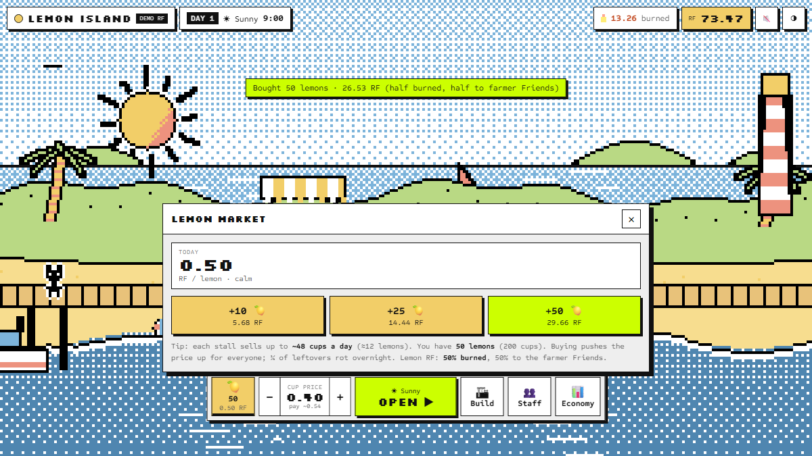
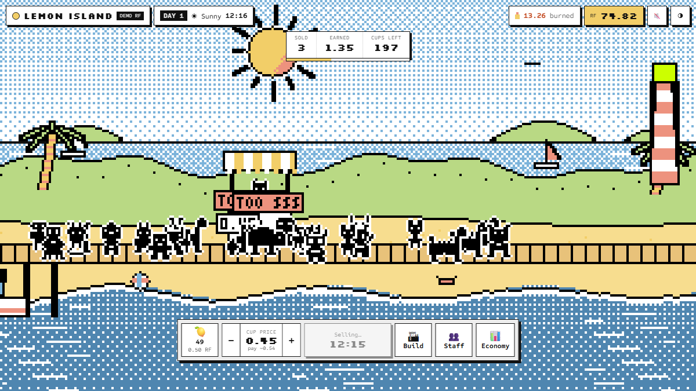
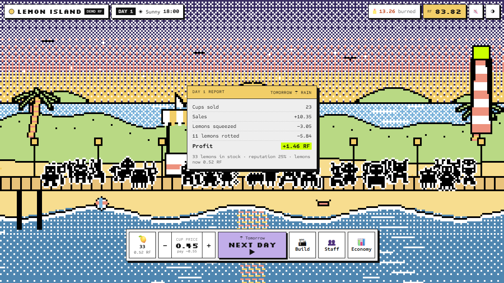
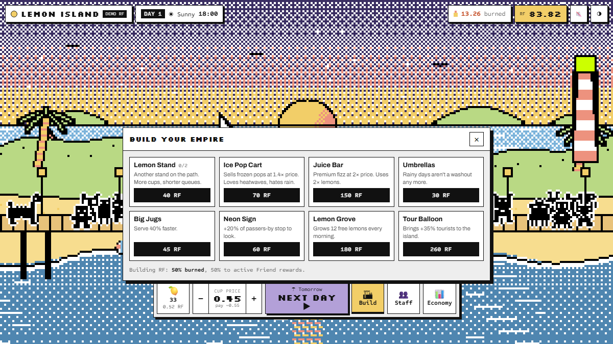

# Lemon Island Tycoon 🍋

**Your Rare Friend opens a lemonade stand on a sunny beach island and grows it into a juice empire, in a living economy where lemon prices move with demand, RF circulates between real Friends, and every build burns RF.**

Rare Friends Vibeathon · **Economy Potential** · FriendSDK **v0.1.2**


🎮 **Play:** https://bbczzzs.github.io/lemon-island/ requires a browser wallet on Robinhood mainnet (4663) holding a hardwired Rare Friends Generations NFT (gen ≥ 1), the SDK's standard gate. All RF is **simulated demo RF**.
🎬 [Full recording (MP4)](media/lemon-demo.mp4)

| Morning market | Selling day | Evening report | Build your empire |
|---|---|---|---|
|  |  |  |  |

## In one minute
- **Buy lemons** on a shared market (the price rises as players buy), **set your cup price** for the weather, **open**. Real Rare Friends arrive by ferry and decide whether your lemonade is worth it.
- **Grow:** more stands, an Ice Pop Cart, a Juice Bar, umbrellas, big jugs, a neon sign, a lemon grove, a tour balloon.
- **Hire real Friends** to run extra stalls; their wages go into their own wallets.
- **RF flows:** lemons are 50% burned and 50% paid to farmer Friends; builds are 50% burned and 50% to Friend rewards; a quarter of unsold lemons rot overnight.
- Weather matters: heatwaves, rain, and a Festival every 7th day.

Full rules, economy and checks: [`games/lemon/README.md`](games/lemon/README.md).

## Develop
```sh
npm install
npx friendsdk dev games/lemon                    # local preview (real wallet gate)
npx friendsdk build games/lemon --outdir dist    # static build
npm run typecheck
node test-interaction.mjs 960                    # needs: npx playwright install chromium
```

The repo root (`index.html`, `game.*`, `runtime.*`, `assets/`) is the built static preview served by GitHub Pages.

All art is drawn in code, all audio is synthesized, and Friend sprites are canonical Rare Friends artwork via FriendSDK. Fonts: Silkscreen, Sometype Mono, Archivo (SIL OFL).
