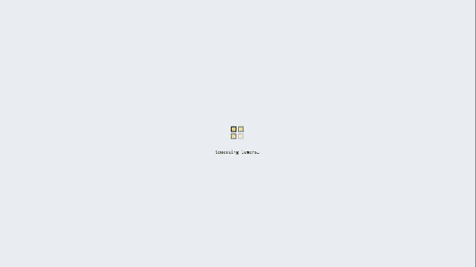

# Lemon Island Tycoon 🍋

**Your Rare Friend opens a lemonade stand on a sunny beach island and grows it into a juice empire, in a living economy where lemon prices move with demand, RF circulates between real Friends, and every build burns RF.**

Built with FriendSDK **v0.1.2** for the Rare Friends Vibeathon · Category: **Economy Potential**

## How it plays

Each day is about 36 seconds:

1. **Morning.** Check the weather forecast, buy lemons at the **market** (1 lemon = 2 cups) and set your **cup price**.
2. **Open.** Real Rare Friends arrive by ferry and walk the boardwalk. Thirsty ones compare your price with what they'll pay today. Cheap enough means they queue and walk off holding a lemonade, too expensive gets a "TOO $$$", and running out means "SOLD OUT". A mood meter and a one-line hint ("Too pricey! Friends pay ~0.90 today") tell you what to fix, and the button to press next blinks.
3. **Evening.** A report card shows cups sold, sales, costs and profit. A quarter of leftover lemons rot overnight, so plan your stock.
4. **Grow.** Reinvest in more **Lemon Stands** (Friends get thirsty at different points on the beach, so stands spread along it catch more of them), an **Ice Pop Cart** (1.4× price, loves heatwaves), a **Juice Bar** (2× price, 2× lemons), **Umbrellas**, **Big Jugs**, a **Neon Sign**, a **Lemon Grove** (12 free lemons a day) and a **Tour Balloon** (+35% tourists).
5. **Hire Friends.** Every extra stall needs a real Friend to run it, paid daily wages.

Weather changes everything: heatwaves pay more, rain empties the boardwalk (unless you have umbrellas), and every 7th day is a **Festival** with huge crowds.

## The economy (why it fits Economy Potential)

All RF is **simulated demo RF** (100 to start) and labelled as such. RF never appears from nowhere: every flow is RF moving between players and Friends, or burned.

| Flow | Rule |
|---|---|
| **Customers → you** | Friends pay your cup price for every cup |
| **Lemons** | Bought on a shared market: **50% burned, 50% to the farmer Friends' wallets** |
| **Lemon price** | Player-driven: every lemon bought today lifts the price 0.25%; overnight it moves with total demand (you + rival tycoons), relaxes toward 0.50 RF, and shocks on heatwaves and grove blight |
| **Buildings & upgrades** | **50% burned, 50% to active Friend rewards** (the Rare Friends 50/50 gameplay-payment rule) |
| **Helpers** | 1.5 RF/day each, paid **straight into the hired Friend's own wallet** |
| **Spoilage** | 25% of leftover lemons rot overnight, a natural sink that rewards good forecasting |

**What makes it a real economy, not a price table:**
- **Supply and demand you can feel.** Prices respond to what players buy.
- **Real decisions every day.** How many lemons for tomorrow's weather? What price clears the queue without scaring people off? Is a Juice Bar worth it yet?
- **RF circulates between real Friends:** customers, farmers and helpers are all real Generations Friends with their own wallets.
- **Sinks that scale with success.** Bigger empires buy more lemons, build more and hire more, so they burn more.
- **An island value leaderboard** against rival tycoons.
- **A 30-day forecast in the Economy sheet**, played headlessly with the game's own crowd, market and ledger code (`forecast.ts`).

**Proven in simulation** ([ECONOMY.md](../../ECONOMY.md), `npm run economy`, 4 strategies × 25 seeds): a steady player burns ~518 RF and pays ~648 RF to other Friends in 30 days; pricing 40% too high sells 60% fewer cups; builders overtake savers around day 36 and end day 60 2.2× richer; no sensible run goes broke.

## Rare Friends integration

- **Your verified Friend owns the island** and runs the first stand. The SDK handles the wallet, Friend selection and the ownership gate, and the sprite is read with `createFriendReader()`.
- **The crowd, farmers and helpers are real Generations Friends**, their canonical on-chain sprites baked into `friends.json`. Friends stay canonical black and white.
- The look follows the FriendSDK style (paper, ink, `GAME_PALETTE`, square corners, hard shadows), set on a beach island with a ferry dock, lighthouse, palms and a sunset over the sea.

## Run it

- Node.js 22+ · `npm install`
- `npx friendsdk dev games/lemon`: needs a browser wallet on **Robinhood mainnet (4663)** holding a hardwired Generations NFT (gen ≥ 1), the SDK's standard gate.
- `npx friendsdk build games/lemon --outdir dist`: static build.

Controls: **Space** opens the day or starts the next one · **[ ]** change price · **M** sound. Everything also works by tap.

## Checks

- `npm run typecheck`: strict TypeScript, 0 errors.
- `node test-interaction.mjs 960` and `390`: in the real sandboxed runtime with the SDK's mock wallet. Covers buying lemons (balance falls by the quoted cost), changing the price, opening the day, cups selling, the evening report, building a stall, hiring a Friend to run it, the Economy sheet and the next morning.
- `npx friendsdk check games/lemon` and `npx friendsdk test` at 1200 px and 360 px.
- `npm run economy`: 30-day headless simulation of four strategies × 25 seeds, written to `ECONOMY.md`.

## Known limitations

- Rival tycoons and the crowd are simulated (the SDK has no multiplayer or shared state).
- `game.json` holds the placeholder chance-game definition the runtime schema requires; Lemon Island runs its own documented ledger (`economy.ts`).
- Progress resets on reload (no SDK storage).
- Going live would need a shared lemon market contract (burn + farmer-reward split), build payments through the 50/50 rule, and wage transfers to Friend wallets.

## Credits

All art (scene and pixel UI icons) is drawn in code and all audio is synthesized with WebAudio. Friend sprites are canonical Rare Friends Generations artwork via FriendSDK (`NOTICE.md`). Fonts: Silkscreen, Sometype Mono and Archivo (SIL OFL, bundled). Built with Claude Code.
